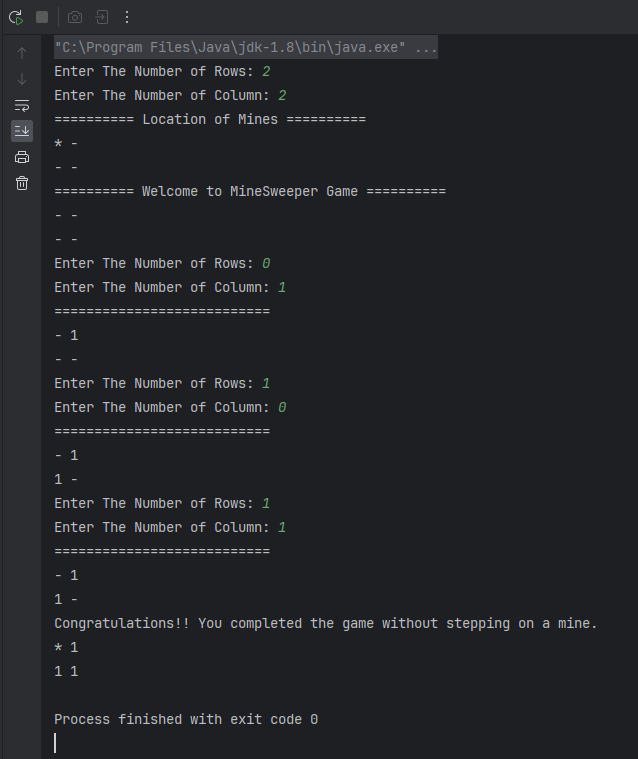
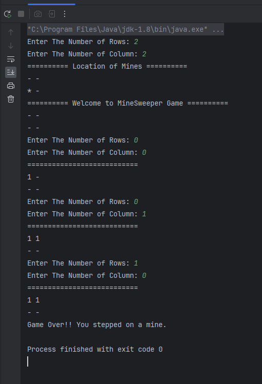
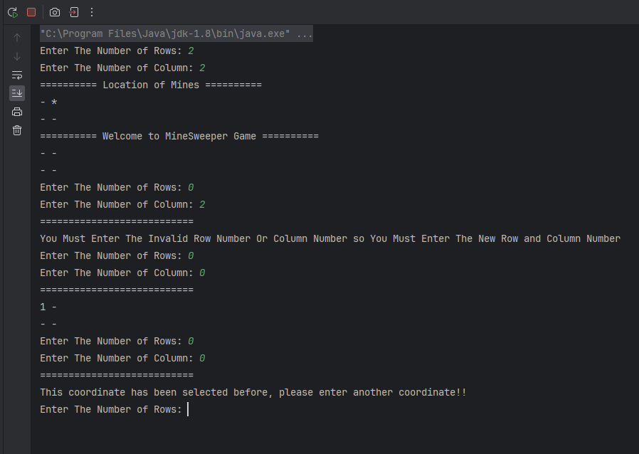

 
<h1 style="text-align:center; color: yellow"> Mine Sweeper Game </h1> 

 This project was developed with version 1.8 of the Java programming language. 

---

<h2 style="text-align:center; color: yellow"> Description Of The Game </h2>

 Minesweeper game is a game that has been and continues to be played very popularly around the world.
In this game, the user is asked the size of the board they want to play and the user determines the size of the board himself, provided that the rows and columns are not less than 2 units.
The user's board contains 1/4 of the number of rows and columns of mines he selected when the game starts.
The user selects the row and column number and it is checked whether there are any mines in the corresponding square. If there are mines, the game is lost. If there are no mines, the user is informed how many mines are touching the selected square.
If the user opens all the non-mine squares without stepping on a mine, user wins the game. 

 

<h3 style="text-align:center; color: yellow"> Game Rules: </h3>  
<li> The game board cannot be smaller than 2*2 </li> 
<li> Row and column numbers start from 0 </li> 
<li> The user should not enter invalid row and column numbers, user will be warned if he does </li> 
<li> Previously entered coordinates should not be entered again, if they are entered, the user will receive an appropriate warning. </li> 

<h3 style="text-align:center; color: yellow"> Technical Description of the Project </h3> 
The project was implemented with Java version 1.8 and the Random class was used to generate random numbers in this project.
User board, mine board, position information of mines in rows and columns were created with an array structure.
 

 
<h3 style="text-align:center; color: yellow">  Explanation of Variables: </h3>

 String mineBoard[][] : Response board including location of mines 
 

 String[][] userBoard : The board the user sees 
 

 int boardRowNumber, boardColNumber : total number of rows and column of the board 
 

 int selectedBoardRowNumber, selectedBoardColNumber : It keeps the index of the column and row selected by the user. 
 

 int mineCount : Keeps the total number of mines 
 

 int[] mine_column,  int[] mine_row : Keeps row and column information of mines 
 

 String closeSquare = "-" : Symbol indicating unopened boxes 
 

 String mineSquare = "*" : Symbol indicating mines 
 

 int neighborMineCount : Number of neighboring mines 
 

 int gameStepCounter = 0 : Number of steps of the game 

 Random random = new Random() : It allows us to generate random numbers 
 

 Scanner input = new Scanner(System.in) : Allows us to receive data from the user 
 

<h3 style="text-align:center; color: yellow"> Explanation of Methods </h3> 

 MineSweeper() : This is a constructor. The reason why it is empty is that we will not be receiving any data from the main method, so I let Java create it automatically.
  

 takeUserInputAndCreateBoard() : It asks the user how many rows and columns it wants to create in the board and checks whether it complies with the rules. 
 

 generateRandomNumber() : Generates random numbers and assigns mines to rows and columns according to these random numbers 
 

 createMineBoard() : This function creates the main board where we can see the locations of the mines. 
 

 createUserBoard() : It is the function where a welcome message is given to the user and the user board is created. 
 

 takeUserAnswer() : The user is asked for the row and column he wants to select. Then, it is checked whether the coordinates entered by the user have been entered before, and if not, the function that checks whether there are mines in the entered coordinates is called. If they have been entered before, the user is given a warning to enter a different coordinate. 
 

 countNeighborMines() : This function calculates the number of mines adjacent to the selected coordinate. 
 

 checkUserInput() : It checks if there are any mines in the user's selected tile and then calls the updateBoard function to update the user's board. 
 

 controlMineOrNull() : While creating the user board, this function replaces the mine symbols and null values on the mine board with the close square variable and helps the user create the desired appearance of the board. 
 

 updateBoard() : This function is a transition function, that is, only functions are called and parameters are provided to these functions. Here, before the user board is updated, the checkGame function is called, and with this function, the function that checks scenarios such as whether the game is completed or not is called, and the user board is updated accordingly. 
 

 printFinalStageAnswerBoard() : It is the function that creates the user board that will be printed on the screen in case of winning the game. 
 

 checkGameResult() : The task of this function is to check whether the user won, lost or continues the game. 
 

 showWinGameMessage() : In the scenario where the user wins the game, it calls the win message and the final state of the board to be shown to the user. 
 

 loseGameMessage() : In a scenario where the user loses the game, it calls the "lose" message and the final state of the board to be shown to the user. 
 

 runGame() : This function is the main function and all functions are called from here and this function must be called through the derived object within the main method. 
 
 

<h3 style="text-align:center; color: yellow">  Game Images </h3>
 Mine Sweeper Win Condition 

<h4 style="text-align:center; color: yellow"> Contact </h4> 

 <a href="ferhatseker180@gmail.com"> Gmail </a>  
 

 <a href="https://github.com/ferhatseker180"> Github  </a> 
 

 <a href="https://www.linkedin.com/in/ferhat-%C5%9Feker-2410571a4/"> Linkedin </a> 
 
 

